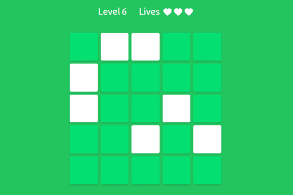

# 🧠 Memory Tiles – Visual Memory Game

A visual memory game inspired by HumanBenchmark, built with **React** and **Tailwind CSS**.  
The goal is simple: remember the highlighted tiles and select them correctly as the difficulty increases.

## 🎮 Demo

👉 Live Demo: [https://aymaneonline.github.io/memory-tiles/]  
👉 Screenshot / GIF:
<p>
  
  
</p>

---

## 🧩 Features

- Progressive difficulty (board size and tile count increase with levels)
- Memorization & selection phases
- Limited lives system
- Smooth tile animations (flip & shake)
- Sound effects for game actions
- Win / lose flash overlay
- High score saved using `localStorage`
- Fully responsive layout

---

## 🛠️ Built With

- **React**
- **Tailwind CSS**
- **JavaScript (ES6+)**
- **CSS animations**
- **HTML5 Audio API**

---

## 🧠 Game Mechanics

- Tiles briefly appear during the **memorization phase**
- Player selects tiles during the **selection phase**
- Wrong selections reduce lives
- Completing a level increases difficulty
- Game ends when all lives are lost

---

## 📂 Project Structure

```text
src/
├── Game/
│   ├── Game.jsx
│   ├── GameMenu.jsx
│   ├── GameScreen.jsx
│   ├── GameOverScreen.jsx
│   └── FlashOverlay.jsx
├── Board/
│   ├── Board.jsx
│   └── Tile.jsx
├── utils/
│   └── sounds.js
├── index.css
└── App.jsx
```

---

## 🚀 What I Learned

- Managing complex UI state with React hooks
- Handling game phases and transitions cleanly
- Creating reusable components
- Building animations with CSS and Tailwind
- Using sound effects responsibly in web apps
- Structuring a medium-sized React project
- Refactoring state management using `useReducer`

---

## 🔮 Possible Improvements

- Add keyboard support for accessibility
- Add difficulty selection
- Improve animations with Framer Motion

---

## 📌 Author

**Aymane**  
Frontend Developer  
[GitHub](https://github.com/aymaneonline) • [Portfolio](https://aymaneonline.dev)
